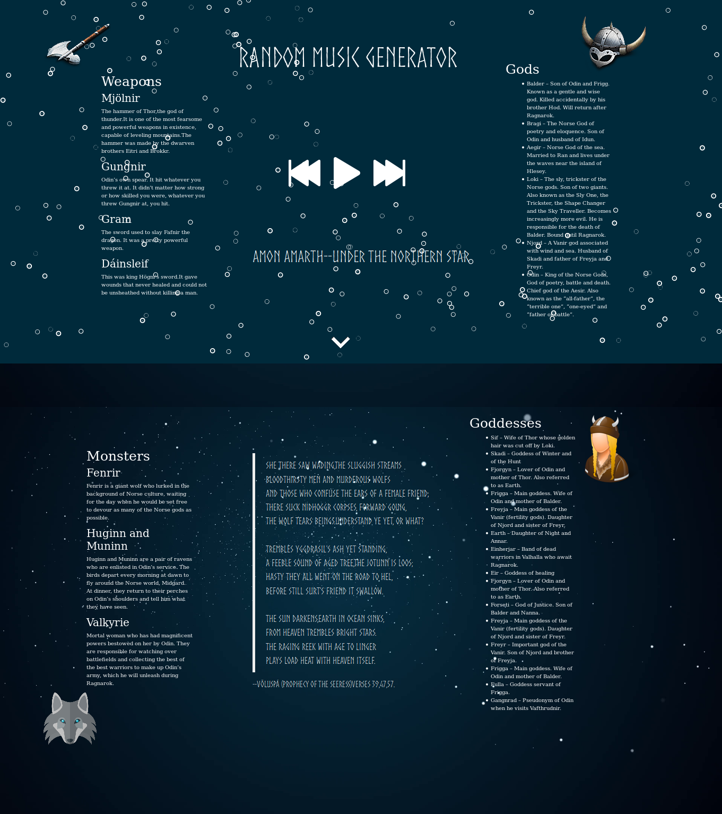

# Ragnarok-Party-Shuffle

[Ragnarok](images/Screenshot-2018-3-8 Ragnarök Party Shuffle.jpg)

## Brief description of application
This is a web app timer for Nordic end days that subsequently becomes a music shuffle player
Version 1.

### List of contributors
 * Agnes Musyoka.
 * Brenda Kiptim.
 * Cynthia Tara.
 * Isaac Musyoka.
 * Joyce Wambui.

### Description
This is a web app dedicated to Ragnarok, a major event in Norse Mythology signifying the end of times.It consists of a timer to the event and a subsequent playlist dubbed "Death Party".The playlist can be accessed once the timer goes off.

### Setup/Installation Requirements
* Add Bootstrap cdn to your index.html file to include bootstrap
* Include the particle.js library by either:
  * Installing it via npm.
  * Include the cdn link to your html file.

### Technologies Used
_HTML_,_CSS_,_Bootstrap_,_Javascript_,Jquery_,_Particle.js_

#### Support and contact details
For any questions you can raise to the following emails:
* _musyokaisaac98@gmail.com_
* _kavatamusyoka24@gmail.com_
* _kiptim54@gmail.com_
* _jwambui@protonmail.com_
* _cynthiataragon@gmail.com_

#### Link to site
[Ragnarok Party shuffle]()

#### License
_MIT LICENSE_
